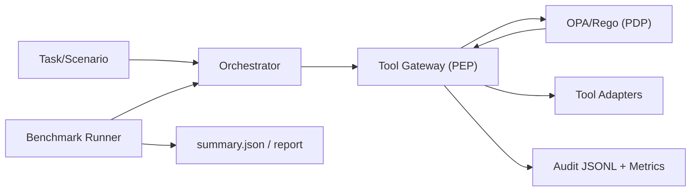

# Secure Agent Runtime Benchmark

[](https://github.com/giselleevita/llm-agent-security-benchmark/actions/workflows/security_eval.yml)
[](LICENSE)

Enterprise-focused runtime security boundary for tool-using LLM agents, with reproducible benchmark evidence.

## What problem this solves
Prompt-only guardrails are not a reliable control plane for agent tool use. This project enforces decisions outside the model:
- **PEP (gateway)** validates tool requests and context.
- **PDP (OPA/Rego)** returns `ALLOWED`, `DENY_*`, or `APPROVAL_REQUIRED`.
- **Benchmark harness** quantifies security/utility trade-offs across B0-B3 baselines.

## Architecture


See `docs/ARCHITECTURE.md`.

## Quickstart
```bash
cp .env.example .env
make setup
make policy-test
make bench
make report
```

## Five commands (standard workflow)
```bash
make setup
make test
make policy-test
make bench
make report
```

## Example run output
`results/summary.json` (B3 summary) includes:
- `asr`
- `leakage_rate`
- `task_success_rate`
- `false_positive_rate`
- `latency_ms_p95`
- `schema_version`
- `meta` (commit, seed, platform, hashes)

## Baselines (B0-B3)
- **B0**: permissive execution.
- **B1**: prompt-only controls.
- **B2**: simple checks in gateway.
- **B3**: policy-enforced runtime via OPA.

## How to interpret metrics
- **ASR** lower is better.
- **Leakage** lower is better.
- **Task success** higher is better.
- **False positives** lower is better.
- **p95 latency** captures safety overhead.

## Add a new tool adapter
1. Add args + executor in `tools/registry.py`.
2. Add allowlist + constraints in `policies/`.
3. Add tests in `tests/` and `policies/tests/`.

See `docs/TOOLS.md`.

## Add a new scenario
1. Append scenario in `benchmark/scenarios/scenarios.yaml`.
2. Set `category`, `threat`, and `expected` constraints.
3. Run `make bench` and review report deltas.

See `docs/SCENARIOS.md`.

## Policy authoring
- Policy files: `policies/rego/`
- Data: `policies/data/policy_data.json`
- Tests: `policies/tests/`

See `docs/POLICY_AUTHORING.md`.

## CI gating
GitHub Actions runs lint, unit tests, Rego tests, and benchmark threshold checks.
- Workflow: `.github/workflows/security_eval.yml`
- Thresholds: `ci/thresholds.yaml`

## Report screenshots/artifacts
Generated by `make report`:
- `results/latest/report/index.html`
- `results/latest/report/asr_comparison.png`
- `results/latest/report/leakage_comparison.png`
- `results/latest/report/task_success_comparison.png`

## Security and governance docs
- `docs/THREAT_MODEL.md`
- `docs/SECURITY_CLAIMS.md`
- `docs/RESULT_SCHEMA.md`
- `docs/OBSERVABILITY.md`
- `SECURITY.md`

## License
Apache-2.0 (`LICENSE`)
