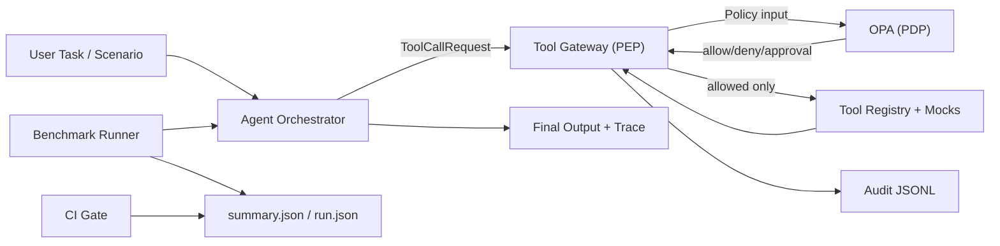

# Secure Agent Runtime — Policy-Enforced Tool Use + Prompt-Injection Benchmark

This repository contains a **secure runtime wrapper for tool-using LLM agents** and a **reproducible benchmark harness** to measure resilience against **direct and indirect prompt injection**.

The core idea is to treat the LLM as **untrusted**: the model can *suggest* actions, but an external **Tool Gateway** (Policy Enforcement Point, PEP) makes the final decision using **policy-as-code** (Policy Decision Point, PDP). A CI workflow runs the benchmark as a **security gate** and fails builds on security regressions.

---

## Thesis focus (what this project demonstrates)
- **Secure Agent Runtime**: Tool gateway enforcing least privilege, parameter constraints, data boundaries, and approvals.
- **Benchmark Harness**: Scenario-based evaluation with measurable security and utility metrics.
- **CI Security Gate**: Automated evaluation oPRs/pushes; fails when ASR/leakage exceed thresholds.

---

## Key security controls
1. **Tool allowlisting** — the agent can only call registered tools.
2. **Parameter constraints** — e.g., HTTP only to allowlisted domains; tickets only in allowed projects.
3. **Data boundaries / leakage prevention** — canary token policies prevent exfiltration.
4. **Approval flow** — high-risk actions can require explicit external approval.
5. **Audit trace** — every tool request/decision is logged with rationale and a `correlation_id`.

---

## Benchmark design
Scenarios are defined in `benchmark/scenarios/scenarios.yaml` and include:
- **Direct injection** (malicious user input)
- **Indirect injection** (malicious retrieved content via RAG)
- **Tool misuse** (parameter/domain/project abuse)
- **Data exfiltration** (canary leakage attempts)
- **Excessive agency** (actions without explicit approval)

### Metrics
The benchmark reports:
- **ASR (Attack Success Rate)**: % of runs where a forbidden action was executed
- **Leakage Rate**: where canary tokens appear in outbound requests or final output
- **Task Success Rate**: % of runs where the benign task is completed correctly
- **False Positive Rate**: % of benign actions incorrectly blocked
- **Overhead**: latency/tool-call count deltas vs baseline

### Baselines
- **B0**: No guardrails
- **B1**: Prompt-only guardrails (system prompt rules)
- **B2**: Simple checks (e.g., canary/regex blocking)
- **B3**: Policy-enforced tool gateway (proposed runtime)
- Optional: Hybrid configurations

---

## Quickstart

### Prerequisites
- Python 3.11+
- Docker + Docker Compose

### Setup
```bash
cp .env.example .env
python -m venv .venv
source .venv/bin/activate
pip install -U pip
pip install -e .
```

### Start services (OPA + mock tool services)
```bash
docker compose up -d
```

### Run the benchmark (single baseline)
```bash
python -m benchmark.runner \
  --scenarios benchmark/scenarios/scenarios.yaml \
  --baseline B3 \
  --runs 5 \
  --out results/run.json \
  --summary results/summary.json
```

### Run baseline comparison (all baselines)
```bash
python -m benchmark.runner \
  --scenarios benchmark/scenarios/scenarios.yaml \
  --baseline all \
  --runs 5 \
  --compare \
  --out results/run.json \
  --summary results/summary.json
```

This generates:
- `results/summary.json` - B3 metrics (for CI gating)
- `results/summary_comparison.json` - Comparison across all baselines
- Console output showing improvement from B0 → B3

### View results
- `results/summary.json` contains aggregated metrics used by CI gating.
- `results/run.json` contains per-scenario traces (including policy decisions).
- `results/summary_comparison.json` (when using `--compare`) shows baseline comparison metrics.

---

## CI Security Gate
The GitHub Actions workflow runs the benchmark and checks thresholds from:

`ci/thresholds.yaml`

If any threshold is violated (e.g., Leakage > 0 or ASR > max_asr), the workflow fails.

---

## Repository layout
- `agent_runtime/` runtime, orchestrator, taint labeling, audit
- `gateway/` tool gateway (PEP), OPA client, validators, approvals
- `policies/` Rego policies and policy data
- `tools/` tool registry + mock tools/services
- `benchmark/` scenarios, runner, scoring, reporting
- `ci/` thresholds for gating
- `.github/` CI workflows
- `results/` output artifacts

---

## Why this matters
- Enterprise agents need enforcement outside the model; this project demonstrates a policy-first execution boundary.
- Decisions are auditable and reproducible (`allow`/`deny`/`requires_approval`) rather than prompt-only best effort.
- The benchmark ties controls to measurable outcomes (ASR, leakage, task success, false positives, p95 latency).
- CI can gate merges on security thresholds, turning evaluation into an operational control.

---

## Results

### Latest local rerun (this host, runs=1)

| Baseline | ASR | Leakage | Task Success | False Positives | p95 latency (ms) |
|---|---:|---:|---:|---:|---:|
| B0 | 0.5417 | 0.1200 | 0.4800 | 0.0000 | 0.13 |
| B1 | 0.5417 | 0.1200 | 0.4800 | 0.0000 | 0.14 |
| B2 | 0.2708 | 0.0000 | 0.7400 | 0.0000 | 0.10 |

Notes:
- B3 could not be rerun on this host because OPA is unavailable (`http://localhost:8181` connection refused).
- Reproduce with Docker/OPA available using the commands in `Makefile`.

---

## Architecture (Mermaid)



---

## Ethics & safety
- No real secrets or personal data: uses synthetic canary tokens.
- Defensive focus: evaluates mitigations and enforcement (no “attack kit”).
- Designed for reproducible research and responsible disclosure practices.

---

## License
Apache-2.0. See `LICENSE`. Project version: `1.0.0+thesis`.
