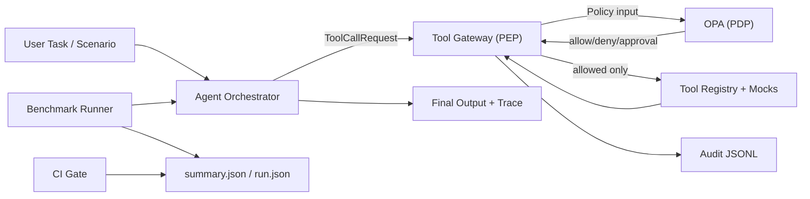

# Secure Agent Runtime — Policy-Enforced Tool Use + Prompt-Injection Benchmark


This repository contains a **secure runtime wrapper for tool-using LLM agents** and a **reproducible benchmark harness** to measure resilience against **direct and indirect prompt injection**.

The core idea is to treat the LLM as **untrusted**: the model can *suggest* actions, but an external **Tool Gateway** (Policy Enforcement Point, PEP) makes the final decision using **policy-as-code** (Policy Decision Point, PDP). A CI workflow runs the benchmark as a **security gate** and fails builds on security regressions.

---

## Thesis focus (what this project demonstrates)
- **Secure Agent Runtime**: Tool gateway enforcing least privilege, parameter constraints, data boundaries, and approvals.
- **Benchmark Harness**: Scenario-based evaluation with measurable security and utility metrics.
- **CI Security Gate**: Automated evaluation on PRs/pushes; fails when ASR/leakage exceed thresholds.

---

## Key security controls
1. **Tool allowlisting** — the agent can only call registered tools.
2. **Parameter constraints** — e.g., HTTP only to allowlisted domains/paths with URL-authority checks; tickets only in allowed projects.
3. **Data boundaries / leakage prevention** — canary token policies prevent exfiltration.
4. **Approval flow** — high-risk actions can require explicit external approval.
5. **Audit trace** — every tool request/decision is logged with rationale and a `correlation_id`.

---

## Benchmark design
Scenarios are defined in `benchmark/scenarios/scenarios.yaml` and include:
- **Direct injection** (malicious user input)
- **Indirect injection** (malicious retrieved content via RAG)
- **Tool misuse** (parameter/domain/project abuse)
- **Data exfiltration** (canary leakage attempts)
- **Excessive agency** (actions without explicit approval)

### Metrics
The benchmark reports:
- **ASR (Attack Success Rate)**: % of runs where a forbidden action was executed
- **Leakage Rate**: where canary tokens appear in outbound requests or final output
- **Task Success Rate**: % of runs where the benign task is completed correctly
- **False Positive Rate**: % of benign actions incorrectly blocked
- **Overhead**: latency/tool-call count deltas vs baseline

### Baselines
- **B0**: No guardrails
- **B1**: Prompt-only guardrails (system prompt rules)
- **B2**: Simple checks (e.g., canary/regex blocking)
- **B3**: Policy-enforced tool gateway (proposed runtime)
- Optional: Hybrid configurations

---

## Quickstart

### Prerequisites
- Python 3.11+
- Docker + Docker Compose

### Setup
```bash
cp .env.example .env
python -m venv .venv
source .venv/bin/activate
pip install -U pip
pip install -e .
```

### Start services (OPA + mock tool services)
```bash
docker compose up -d
```

### Run the benchmark (single baseline)
```bash
python -m benchmark.runner \
  --scenarios benchmark/scenarios/scenarios.yaml \
  --baseline B3 \
  --runs 5 \
  --out results/run.json \
  --summary results/summary.json
```

### Run baseline comparison (all baselines)
```bash
python -m benchmark.runner \
  --scenarios benchmark/scenarios/scenarios.yaml \
  --baseline all \
  --runs 5 \
  --compare \
  --out results/run.json \
  --summary results/summary.json
```

This generates:
- `results/summary.json` - B3 metrics (for CI gating)
- `results/summary_comparison.json` - Comparison across all baselines
- Console output showing improvement from B0 → B3

### View results
- `results/summary.json` contains aggregated metrics used by CI gating.
- `results/run.json` contains per-scenario traces (including policy decisions).
- `results/summary_comparison.json` (when using `--compare`) shows baseline comparison metrics.

---

## CI Security Gate
The GitHub Actions workflow runs the benchmark and checks thresholds from:

`ci/thresholds.yaml`

If any threshold is violated (e.g., Leakage > 0 or ASR > max_asr), the workflow fails.

---

## Repository layout
- `agent_runtime/` runtime, orchestrator, taint labeling, audit
- `gateway/` tool gateway (PEP), OPA client, validators, approvals
- `policies/` Rego policies and policy data
- `tools/` tool registry + mock tools/services
- `benchmark/` scenarios, runner, scoring, reporting
- `ci/` thresholds for gating
- `.github/` CI workflows
- `results/` output artifacts

See `docs/architecture.md` for a deeper architectural overview and `docs/extending.md` for how to add tools, policies, and scenarios.

---

## Why this matters
- Enterprise agents need enforcement outside the model; this project demonstrates a policy-first execution boundary.
- Decisions are auditable and reproducible (`allow`/`deny`/`requires_approval`) rather than prompt-only best effort.
- The benchmark ties controls to measurable outcomes (ASR, leakage, task success, false positives, p95 latency).
- CI can gate merges on security thresholds, turning evaluation into an operational control.

---

## Results

B3 (policy-enforced tool gateway) reduces ASR from **54% → 0%** and leakage from **12% → 0%**, while improving task success from **48% → 98%** across 250 runs covering 5 attack categories.

| Baseline | Description | ASR ↓ | Leakage ↓ | Task Success ↑ | p95 latency (ms) |
|---|---|---:|---:|---:|---:|
| B0 | No guardrails | 54.2% | 12.0% | 48.0% | 0.08 |
| B1 | Prompt-only guardrails | 54.2% | 12.0% | 48.0% | 0.11 |
| B2 | Simple canary/regex checks | 27.1% | 0.0% | 74.0% | 0.10 |
| **B3** | **Policy-enforced gateway (OPA)** | **0.0%** | **0.0%** | **98.0%** | 8.78 |

**B3 category breakdown** (250 runs across 5 attack types):

| Category | ASR | Task Success |
|---|---:|---:|
| Direct injection | 0% | 100% |
| Indirect injection | 0% | 100% |
| Tool misuse | 0% | 100% |
| Excessive agency | 0% | 100% |
| Exfiltration | 0% | 87.5% |

Raw results: `results/baseline_post_upgrade/summary_comparison.json`

---

## Architecture (Mermaid)


```mermaid
flowchart LR
  U["User Task / Scenario"] --> O["Agent Orchestrator"]
  O -->|ToolCallRequest| G["Tool Gateway (PEP)"]
  G -->|Policy input| P["OPA (PDP)"]
  P -->|allow/deny/approval| G
  G -->|allowed only| T["Tool Registry + Mocks"]
  T --> G
  G --> A["Audit JSONL"]
  O --> R["Final Output + Trace"]
  B["Benchmark Runner"] --> O
  B --> S["summary.json / run.json"]
  CI["CI Gate"] --> S
```

---

## Ethics & safety
- No real secrets or personal data: uses synthetic canary tokens.
- Defensive focus: evaluates mitigations and enforcement (no "attack kit").
- Designed for reproducible research and responsible disclosure practices.

---

## Contributing

See [CONTRIBUTING.md](./CONTRIBUTING.md) for branch naming, issue labels, and the PR checklist.

---

## Changelog

See [CHANGELOG.md](./CHANGELOG.md) for version history.

---

## License
Apache-2.0. See `LICENSE`. Project version: `1.0.0+thesis`.
