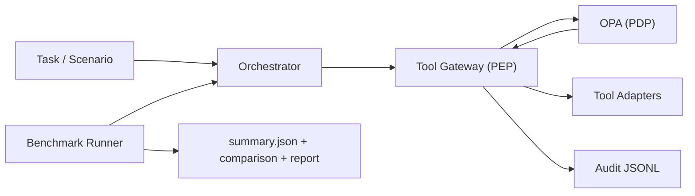

# Architecture

## Components
- `agent_runtime/`: API runtime, orchestrator, audit and metrics.
- `gateway/`: schema validation, PDP calls, policy enforcement decisions.
- `policies/`: Rego policy bundle and OPA tests.
- `tools/`: deterministic adapters + optional hardened real HTTP adapter.
- `benchmark/`: scenario execution, scoring, schema validation.
